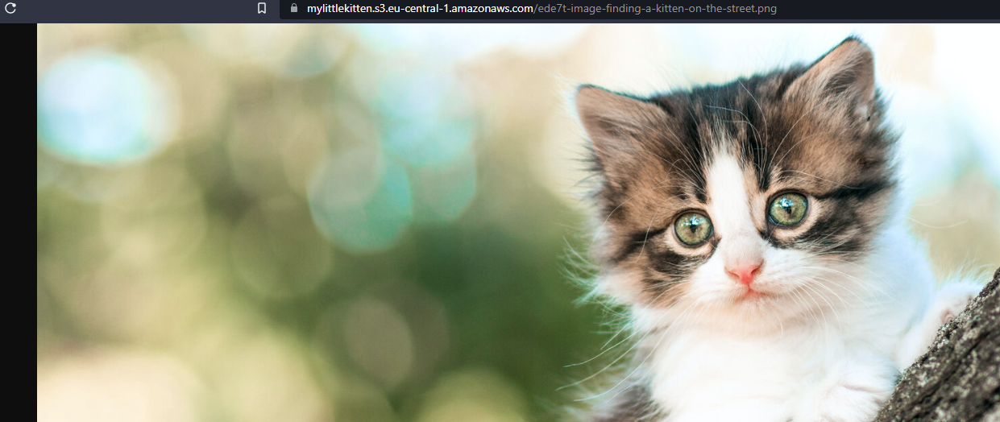

# S3
Simple Storage Service (S3) is een object storage van AWS. Bestanden kunnen gupload en gedownload worden over HTTP(s) met een REST API.

AWS zorgt ervoor dat je bestand durable opgeslagen wordt. Je bestand wordt gekopieerd naar de verschillende Availability Zones in je Regio. Hiermee claimt AWS dat ze 99.999999999% durable is (11 9's) en dat het 99.99% available is.

De data van je bucket is regionaal. Je bucketnaam moet globaal uniek zijn en DNS-compliant.

S3 heeft verschillende storage classes waar je meer of minder betaald voor de opslag en hoeveel je betaald als je een bestand opvraagt.

## Key-terms
- [Object Storage](../beschrijvingen/storage-types.md#Object)
- Storage Classes:
    - Standaard
    - Infrequent Access (IA)
    - Glacier
    - Deep Glacier
    - Inteligent Tiering
- Durability: De kans dat een bestand verloren gaat
- Availability: De kans dat een bestand beschikbaar is (of belangrijker: niet beschikbar)
- REST (verwijzing/uitleg)
- DNS (verwijzing/uitleg)
- etc

## Opdracht
### Gebruikte bronnen
- https://aws.amazon.com/s3/
- https://aws.amazon.com/s3/storage-classes/?nc=sn&loc=3
- https://www.backblaze.com/blog/cloud-storage-durability-vs-availability/
- https://wellarchitectedlabs.com/common/documentation/createnews3bucketandaddobjects/

### Ervaren problemen
- Ik had geen toegang tot mijn foto en kreeg foutmeldingen.
    Ik heb gezocht op Google op de volgende termen 'AWS S3 no file access' en vond een site met een stappenplan hoe dit op te lossen. Ik was vergeten public access aan te zetten.

### Resultaat
Mijn teamgenoot heeft de kattenfoto op kunnen vragen.
